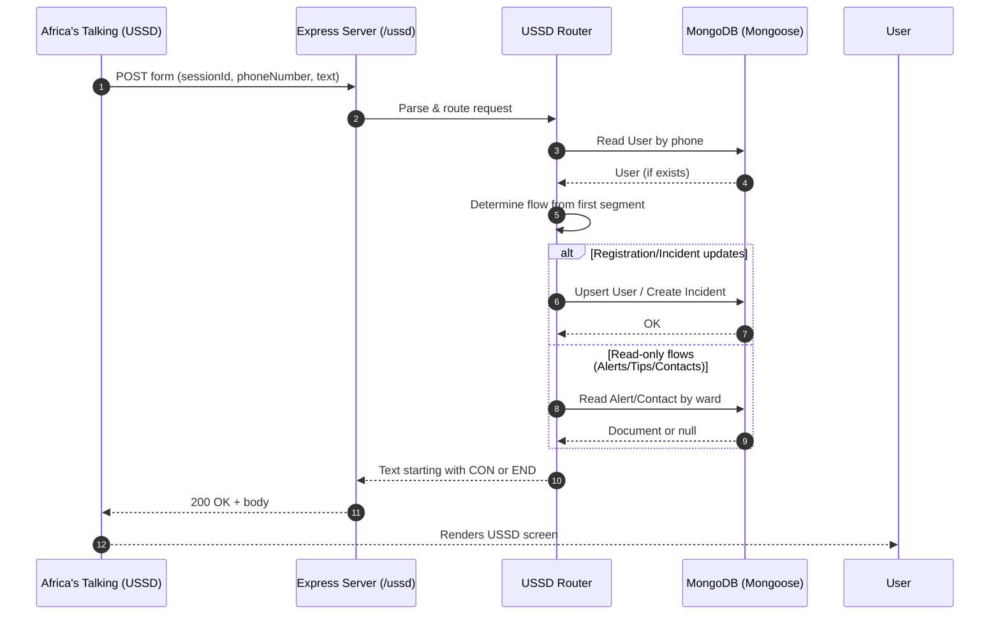
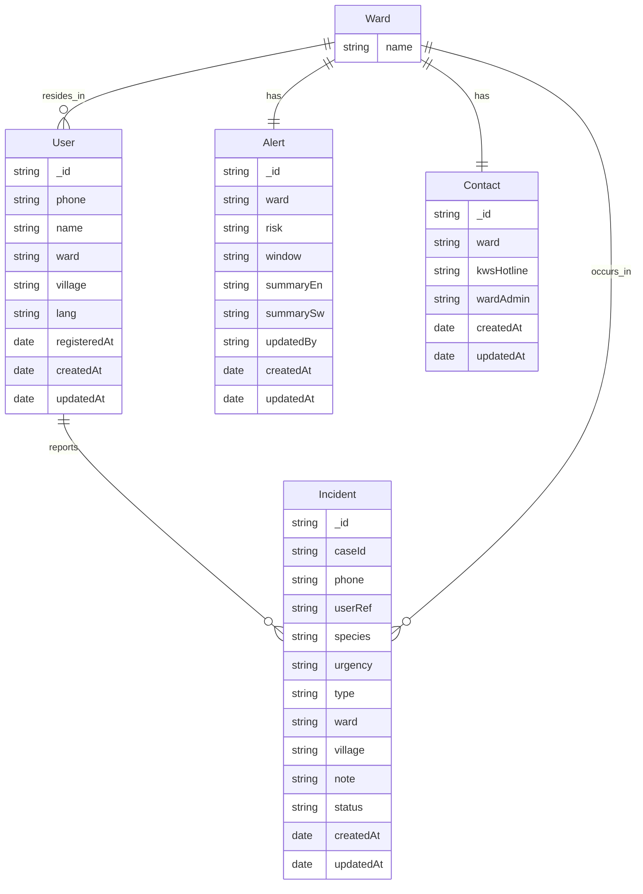
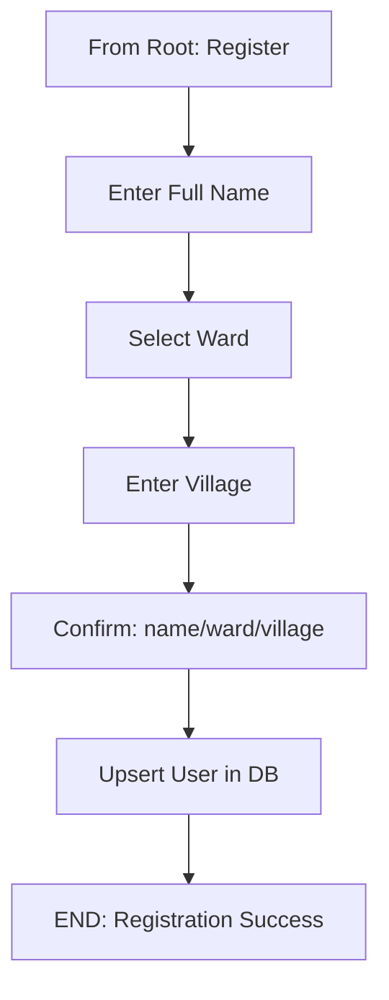
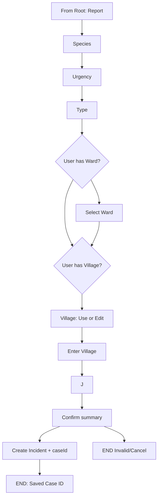
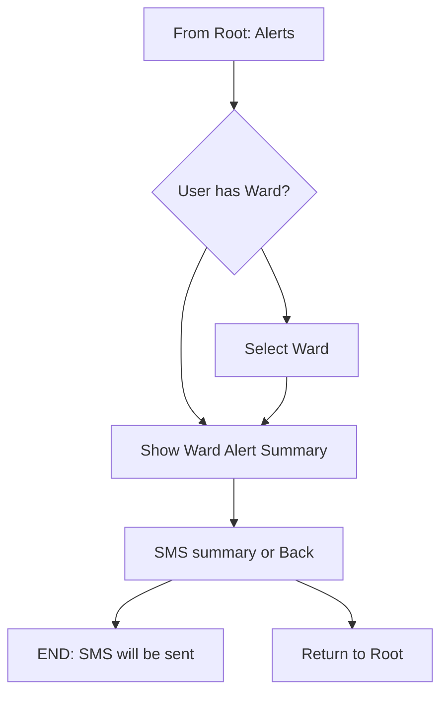
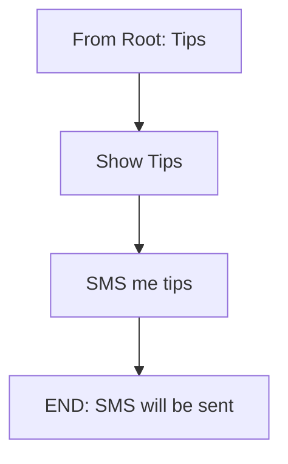
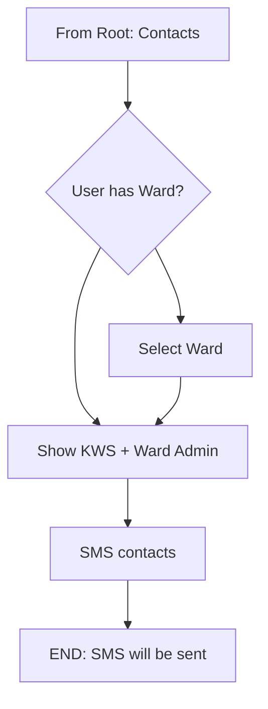
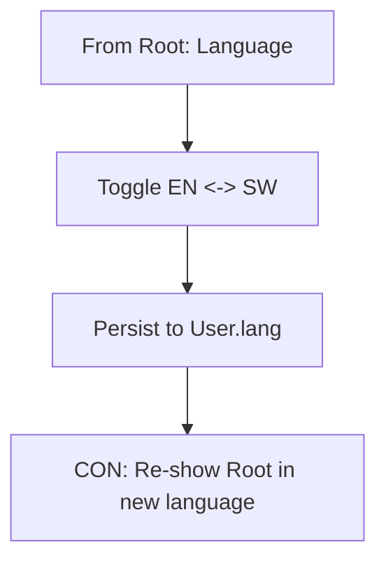
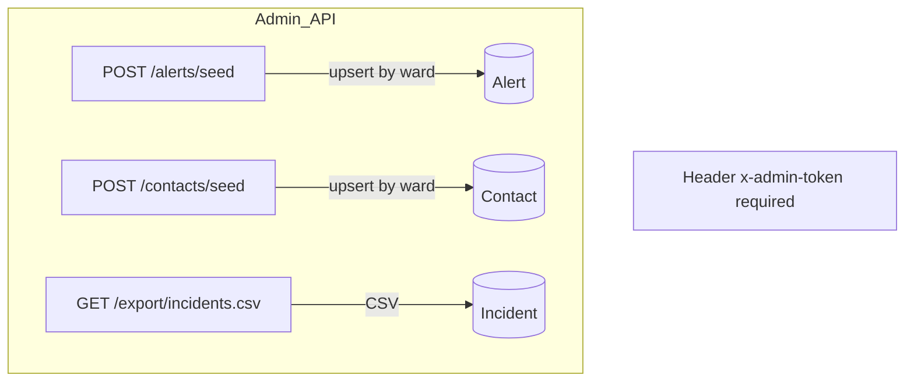

# Hifadhi Link (USSD) -ERD and Flow Diagrams

This document provides visual diagrams of the data model (ERD) and each USSD flow so anyone can quickly understand how the system works by looking at it.

## End‑to‑End Request Flow


## Entity‑Relationship Diagram (ERD)
The system centers on users, their incidents, and ward‑specific alerts/contacts.



Notes:
- `Ward` is a conceptual enum entity backed by a config list (`src/config/wards.js`), not a collection.
- `Incident.userRef` references `User._id` when available; otherwise `phone` is still stored.

## Root Menu
```mermaid
flowchart TD
    A[HIFADHI LINK Root (CON)] --> B[Register]
    A --> C[Report Incident]
    A --> D[Check Alerts]
    A --> E[Prevention Tips]
    A --> F[Emergency Contacts]
    A --> G[Toggle Language]
```

## Flow -Register (1)


## Flow -Report Incident (2)


## Flow -Check Alerts (3)


## Flow -Prevention Tips (4)


## Flow -Emergency Contacts (5)


## Flow -Language Toggle (0)


## Admin -Seeding & Export


## Where Things Live
- USSD Router: `src/ussd/router.js`
- Models: `src/models/User.js`, `src/models/Incident.js`, `src/models/Alert.js`, `src/models/Contact.js`
- Wards enum: `src/config/wards.js`
- Admin routes: `src/web/admin.js`

## How To View
- GitHub and many editors render Mermaid code blocks directly.
- If not, paste code blocks into an online Mermaid viewer to see the diagrams.
