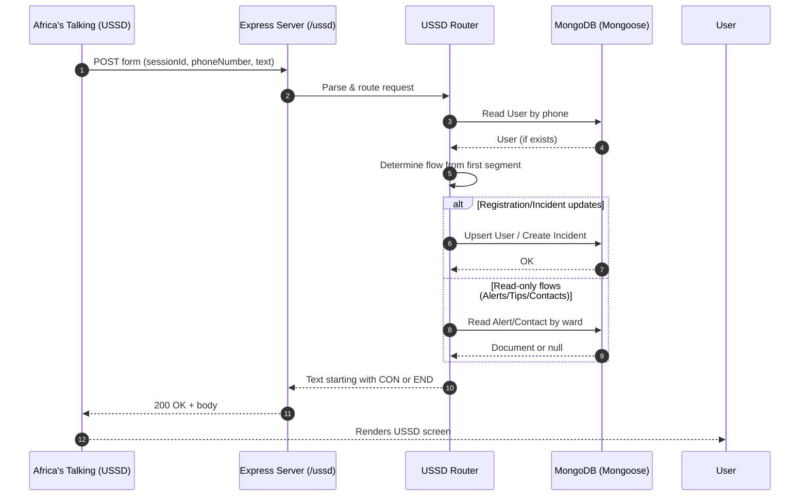
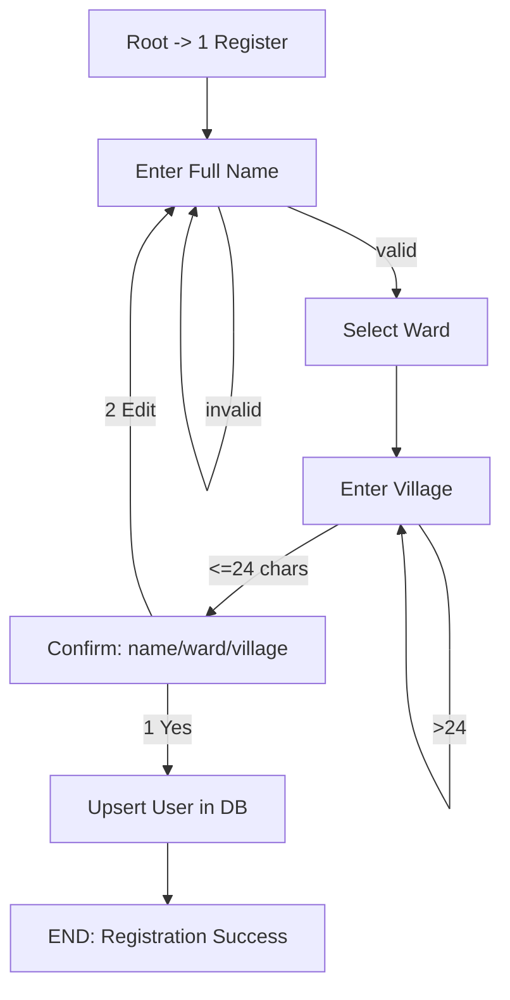
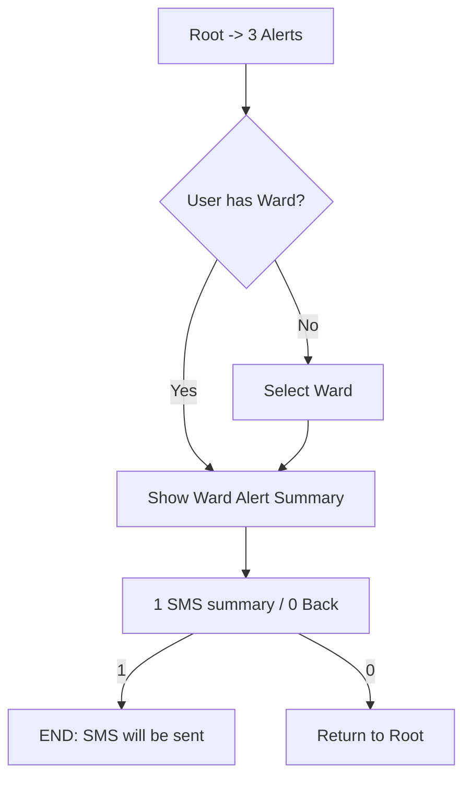
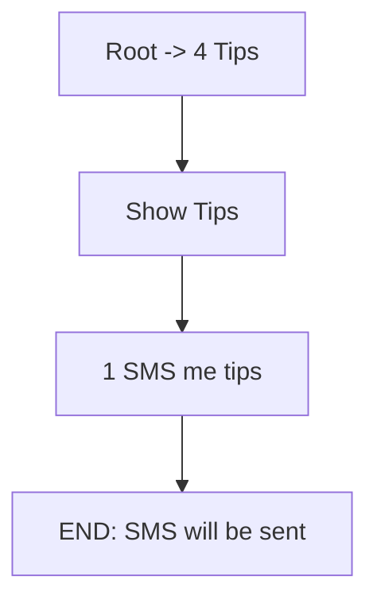
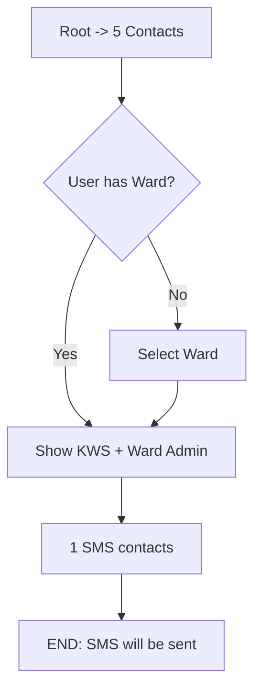
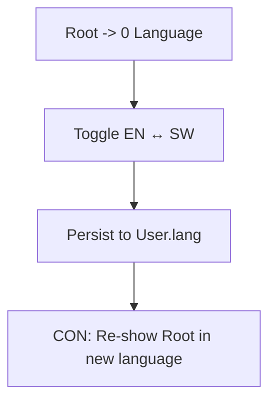

# Hifadhi Link (USSD) — ERD and Flow Diagrams

This document provides visual diagrams of the data model (ERD) and each USSD flow so anyone can quickly understand how the system works by looking at it.

## End‑to‑End Request Flow


## Entity‑Relationship Diagram (ERD)
The system centers on users, their incidents, and ward‑specific alerts/contacts.

```mermaid
erDiagram
    User ||--o{ Incident : reports
    Ward ||--|| Alert : has
    Ward ||--|| Contact : has
    Ward ||--o{ Incident : occurs_in
    Ward ||--o{ User : resides_in

    User {
        string _id
        string phone PK, unique
        string name
        string ward
        string village
        enum   lang (EN,SW)
        date   registeredAt
        date   createdAt
        date   updatedAt
    }
    Incident {
        string _id
        string caseId PK, unique
        string phone
        ObjectId userRef FK -> User._id
        enum   species (elephant,buffalo,lion,other)
        enum   urgency (now,today,24h)
        enum   type (crop,livestock,fence,human)
        string ward
        string village
        string note (<=80)
        enum   status (new,ack,closed)
        date   createdAt
        date   updatedAt
    }
    Alert {
        string _id
        string ward PK, unique
        enum   risk (LOW,MED,HIGH)
        string window
        string summaryEn
        string summarySw
        string updatedBy
        date   createdAt
        date   updatedAt
    }
    Contact {
        string _id
        string ward PK, unique
        string kwsHotline
        string wardAdmin
        date   createdAt
        date   updatedAt
    }
    Ward {
        string name PK  // Config enum: Sagalla, Marungu, Mbololo, Kasigau
    }
```

Notes:
- `Ward` is a conceptual enum entity backed by a config list (`src/config/wards.js`), not a collection.
- `Incident.userRef` references `User._id` when available; otherwise `phone` is still stored.

## Root Menu
```mermaid
flowchart TD
    A[HIFADHI LINK Root (CON)] -->|1| B[Register]
    A -->|2| C[Report Incident]
    A -->|3| D[Check Alerts]
    A -->|4| E[Prevention Tips]
    A -->|5| F[Emergency Contacts]
    A -->|0| G[Toggle Language]
```

## Flow — Register (1)


## Flow — Report Incident (2)
```mermaid
flowchart TD
    A[Root -> 2 Report] --> B[Species]
    B --> C[Urgency]
    C --> D[Type]
    D --> E{User has Ward?}
    E -->|Yes| G{User has Village?}
    E -->|No| F[Select Ward]
    F --> G{User has Village?}
    G -->|Yes| H[Village: 1 Use / 2 Edit]
    G -->|No| I[Enter Village]
    H -->|1 Use| J[Optional Note (or 0)]
    H -->|2 Edit| I
    I --> J
    J --> K[Confirm summary]
    K -->|1 Submit| L[Create Incident + caseId]
    K -->|2 Cancel| M[END Invalid/Cancel]
    L --> N[END: Saved Case ID]
```

## Flow — Check Alerts (3)


## Flow — Prevention Tips (4)


## Flow — Emergency Contacts (5)


## Flow — Language Toggle (0)


## Admin — Seeding & Export
```mermaid
flowchart TD
    subgraph Admin API [/admin]
        A1[POST /alerts/seed] -->|upsert by ward| A2[(Alert)]
        B1[POST /contacts/seed] -->|upsert by ward| B2[(Contact)]
        C1[GET /export/incidents.csv] -->|CSV| C2[(Incident)]
    end
    note right of Admin API: Header x-admin-token required
```

## Where Things Live
- USSD Router: `src/ussd/router.js`
- Models: `src/models/User.js`, `src/models/Incident.js`, `src/models/Alert.js`, `src/models/Contact.js`
- Wards enum: `src/config/wards.js`
- Admin routes: `src/web/admin.js`

## How To View
- GitHub and many editors render Mermaid code blocks directly.
- If not, paste code blocks into an online Mermaid viewer to see the diagrams.

